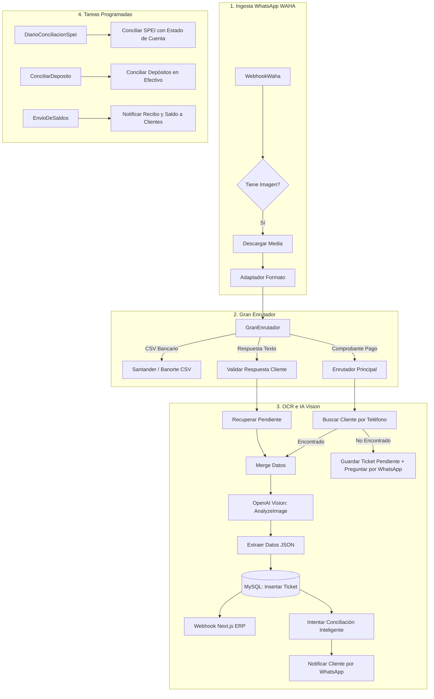

# 📋 Análisis de Arquitectura y Roadmap de Evolución: Flujo n8n TICKETS2

---

## 1. 🏗️ Arquitectura General del Flujo TICKETS2

El flujo **`TICKETS2`** (81 nodos, 79 conexiones) es el motor neurálgico de automatización de cobranza, recepción de comprobantes bancarios, OCR con IA y conciliación bancaria multicanal de Mueblería Daso.



---

## 2. 🔍 Diagnóstico y Cuellos de Botella Detectados

| Componente / Nodo | Situación Actual en TICKETS | Riesgo / Oportunidad |
| :--- | :--- | :--- |
| **OCR Vision (`AnalyzeImage`)** | Usa versión legacy de LangChain OpenAI (`typeVersion: 1.8`, `operation: analyze`). | Riesgo de deprecación en versiones recientes de n8n. Se debe migrar a `@n8n/n8n-nodes-langchain.agent` o `openAi` nativo con structured output. |
| **Persistencia Principal** | Inserta directamente en MySQL (`admin_dasomuebles.ticket`). | Los tickets deben sincronizarse bidireccionalmente en tiempo real con PostgreSQL del ERP (`tickets` table). |
| **Conciliación Bancaria** | Queries directas a `estado_de_cuenta` de MySQL. | No aprovecha los saldos y estados de cuenta en vivo de ContPAQi API ni las cuentas de tesorería del ERP. |
| **Manejo de Errores** | Nodos HTTP sin fallbacks unificados en caso de caída de Waha. | Si Waha se desconecta, los mensajes fallan sin reintentos automáticos estructurados. |

---

## 3. 🗺️ Roadmap de Evolución para TICKETS2

```
Fase 1: Estabilización y Modernización (Actual)
  ├── 1.1 Migración de nodo OpenAI Vision a JSON Schema estructurado
  ├── 1.2 Unificación de variables de entorno (ERP URL, Waha API Key)
  └── 1.3 Validación de no colisión de webhooks con TICKETS (v1)

Fase 2: Integración Nativa con Next.js ERP & ContPAQi
  ├── 2.1 Webhook bidireccional Next.js ERP (/api/webhooks/n8n)
  ├── 2.2 Validación de saldos en ContPAQi API antes de emitir recibo
  └── 2.3 Auto-registro de comprobante en Bóveda Digital de Clientes

Fase 3: Inteligencia de Conciliación y Anti-Fraude
  ├── 3.1 Detección de comprobantes duplicados o editados por IA
  ├── 3.2 Conciliación instantánea contra Santander y Banorte API / Webhooks
  └── 3.3 Generación y envío automático de Recibo Térmico Digital
```

---

### Fase 1: Estabilización y Modernización de Nodos (Inmediato)
* **Objetivo:** Garantizar que el flujo compile y ejecute sin advertencias en n8n 2.x.
* **Acciones:**
  1. Actualizar el nodo `AnalyzeImage` para utilizar `chat` con `gpt-4o-mini` / `gpt-4o` enviando la imagen en base64 y requiriendo un **JSON Schema estricto** (evita fallos de parseo en `ExtraeDatos`).
  2. Configurar la URL de Webhook de Waha en `TICKETS2` con una ruta diferenciada (`/webhook/waha-tickets2`) para permitir pruebas seguras en paralelo con producción.

---

### Fase 2: Integración Profunda con ERP y ContPAQi (Corto Plazo)
* **Objetivo:** Que cada ticket recibido actualice inmediatamente el ERP y verifique saldos comerciales.
* **Acciones:**
  1. Enriquecer el payload enviado al webhook del ERP (`NextjsErpWebhook` $\rightarrow$ `/api/webhooks/n8n`):
     - `clienteId`, `monto`, `folio`, `banco`, `claveRastreo`, `urlComprobante`.
  2. Consultar el saldo actualizado en ContPAQi API (`/api/Documentos/cliente/{cod}`) para incluir el saldo pendiente exacto en el mensaje de WhatsApp que recibe el cliente.
  3. Vincular automáticamente la imagen del ticket con la **Bóveda de Documentos** del cliente en `/dashboard/ventas/boveda`.

---

### Fase 3: Conciliación Inteligente y Anti-Fraude (Mediano Plazo)
* **Objetivo:** Conciliación en tiempo real y detección de transferencias falsas o reutilizadas.
* **Acciones:**
  1. **Regla Anti-Duplicados:** Validar por `claveRastreo` + `monto` + `cuentaDestino` tanto en PostgreSQL como en MySQL antes de dar por válido un pago.
  2. **Generación de Ticket PDF / Térmico Digital:** Generar la imagen del ticket térmico con código QR y enviarla adjunta en el mismo mensaje de confirmación de WhatsApp.
  3. **Escalamiento a Cobrador:** Notificar automáticamente al gestor de cobranza asignado cuando su cliente realice una transferencia.

---

## 4. 📊 Matriz de Nodos Clave en TICKETS2

| Nodo | Función | Entrada | Salida |
| :--- | :--- | :--- | :--- |
| `WebhookWaha` | Receptor de mensajes de WhatsApp | Webhook HTTP POST | Payload de mensaje (texto o imagen) |
| `GranEnrutador` | Clasifica entre extracto bancario, ticket o respuesta | JSON de WhatsApp | Rama de ejecución especializada |
| `AnalyzeImage` | OCR con Inteligencia Artificial | Archivo Binario (JPG/PNG) | JSON con datos del pago (monto, fecha, rastreo) |
| `InsertarTicket` | Guarda el ticket en base de datos | Variables extraídas | ID del Ticket generado |
| `NextjsErpWebhook` | Notifica al ERP en tiempo real | Datos del Ticket + Cliente | HTTP 200 OK en ERP |
| `IntentarConciliacionInteligente` | Cruza con extracto bancario SPEI | Clave de rastreo y fecha | Estado: `CONCILIADO` o `PENDIENTE` |
| `EnviarPorWaha` | Envía confirmación al cliente | Mensaje formateado | Mensaje enviado por WhatsApp |
