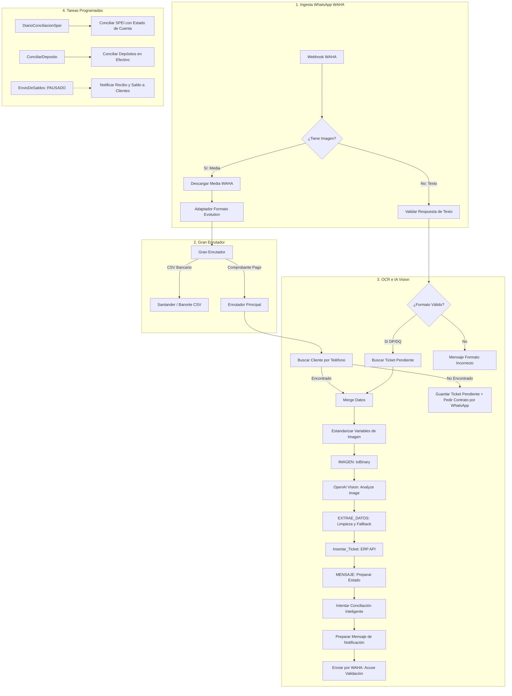

# 📋 Análisis de Arquitectura y Roadmap de Evolución: Flujo n8n TICKETS2

---

## 1. 🏗️ Arquitectura General del Flujo TICKETS2

El flujo **`TICKETS2`** (81 nodos, 79 conexiones en producción sobre n8n 2.34.5) es el motor neurálgico de automatización de cobranza, recepción de comprobantes bancarios, OCR con IA y conciliación bancaria multicanal de Mueblería Daso.



---

## 2. 📝 Bitácora de Cambios y Correcciones Realizadas (03/09/2026)

### 🔴 Fix 1: Error 400 en OpenAI Vision (`Analyze image`) por modo `filesystem-v2`
* **Síntoma:** OpenAI rechazaba imágenes con `400 - You uploaded an unsupported image. Please make sure your image has one of the following formats: ['png', 'jpeg', 'gif', 'webp']`.
* **Causa Raíz:** Con `N8N_DEFAULT_BINARY_DATA_MODE=filesystem`, n8n almacena binarios en disco y expone el puntero textual `"filesystem-v2"` (13 bytes) en `binary.data.data`. El nodo `Estandarizar Variables de Imagen` evaluaba `$('Descargar Media WAHA')?.item?.binary?.data?.data` antes que el payload base64 real de WAHA, inyectando un archivo ficticio de 13 bytes a OpenAI.
* **Solución:** Se corrigieron las expresiones en `Estandarizar Variables de Imagen`, `Unir Datos de Busqueda` y `GuardarTicketPendiente` para priorizar el Base64 íntegro de WAHA (`$json.body?.data?.message?.base64` o `$json.body?.payload?.media`), garantizando JPEGs de 30–100 KB válidos.

---

### 🔴 Fix 2: Respuestas de Texto de Clientes Desconectadas (`¿Tiene Imagen?.out(1)`)
* **Síntoma:** Clientes que enviaban su comprobante sin contrato en la foto recibían la pregunta del bot *"Por favor envía tu número de contrato"*, pero al responder por texto (ej. `"DQ2510118"`), el bot no procesaba nada y la ejecución finalizaba en silencio sin registrar el ticket.
* **Causa Raíz:** La salida `False` (out 1) del nodo condicional `¿Tiene Imagen?` no estaba conectada a ningún nodo; `Validar Respuesta de Texto` era un nodo huérfano. Además, dicho nodo esperaba la estructura legacy de Evolution API en lugar de WAHA (`$json.body?.payload?.body`).
* **Solución:** Se conectó `¿Tiene Imagen?.out(1)` a `Validar Respuesta de Texto` y se actualizó el parseo para leer `$json.body?.payload?.body`, permitiendo que el contrato enviado por texto recupere automáticamente el ticket pendiente y continúe el procesamiento OCR.

---

### 🔴 Fix 3: Pérdida de Contrato en Caption de WhatsApp en `EXTRAE_DATOS`
* **Síntoma:** Al enviar un comprobante bancario donde el contrato no está impreso en el papel/recibo (ej. transferencia Mercado Pago `DQ2601058`), pero sí escrito en el pie de foto de WhatsApp, el ticket se guardaba como *"Sin Contrato"* en la cola de tesorería y el bot respondía con `- 🆔 ID: N/A`.
* **Causa Raíz:** En `EXTRAE_DATOS`, la lista de nodos examinados para `contratoInicial` no incluía `$('Merge')`, `$('Selector de Acción')` ni el caption del webhook entrante. Si OpenAI devolvía `"contrato": null`, la variable se mantenía nula.
* **Solución:** Se agregaron `$('Merge')?.item?.json?.contrato`, `$('Selector de Acción')?.item?.json?.contrato`, `$('Adaptador a Formato Evolution')?.first()?.json?.body?.data?.message?.imageMessage?.caption` y los payloads de WAHA en `EXTRAE_DATOS` y `Estandarizar Variables de Imagen`.

---

### 🛡️ Fix 4: Política de Notificación al Cliente: Solo Acuse de Validación (Sin Saldo)
* **Requerimiento Operativo:** Al recibir un comprobante, el cliente **nunca debe recibir saldos preliminares ni confirmación de pago aplicado** hasta que tesorería o el conciliador oficial validen el dinero en banco.
* **Ajustes:**
  1. **`Preparar Mensaje de Notificación`:** Se eliminó la rama que enviaba *"¡Tu pago ha sido conciliado y aplicado exitosamente! Nuevo Saldo: $..."*. Ahora todo comprobante nuevo recibe estrictamente el acuse estándar de validación:
     ```text
     📌 *Detalles del Ticket*
     - 🆔 ID: {ticketId}
     - 📅 Fecha: {fecha}
     - ⏰ Hora: {hora}
     - 💰 Monto: ${monto}
     - 🔢 Referencia: {referencia}
     - 📝 Folio: {folio}
     - 📦 Clave de rastreo: {claverastreo}
     --------------------------------
     🚨 *Tu comprobante está en proceso de validación.*
     Ya lo guardamos en el sistema. En cuanto el banco refleje el movimiento, recibirás tu NUEVO SALDO.
     ```
  2. **`Envío de Saldos`:** Se configuró en `disabled: true` el trigger periódico para suspender notificaciones automáticas masivas de saldos a clientes.

---

### 📊 Historial de Tickets Críticos Recuperados y Regularizados (03/09/2026)

| Contrato | Remitente | Banco / Tipo | Monto | Ticket ERP | Estado |
| :--- | :--- | :--- | :---: | :---: | :---: |
| **`DP2603090`** | `136988535562466@lid` | BBVA $\rightarrow$ Santander (Folio `7360695289`) | **$2,230.00** | **`5Q8JH9FB`** | ✅ Conciliado y Saldo Ajustado |
| **`DQ2509096`** | `277167309123741@lid` | BBVA $\rightarrow$ Santander (Folio `0071104008`) | **$200.00** | **`HK6M5F66`** | ✅ Procesado y Notificado |
| **`DP2603150`** | `64304518844534@lid` | BBVA $\rightarrow$ Santander (Folio `0071069804`) | **$250.00** | **`97E07TNK`** | ✅ Procesado y Notificado |
| **`DQ2510118`** | `256091736772799@lid` | Banorte (Folio `DQ2510118`) | **$310.00** | **`NI9EQ3SK`** | ✅ Procesado y Notificado |
| **`DQ2601058`** | `277167309123741@lid` | Mercado Pago $\rightarrow$ Banorte (Folio `177061094488`) | **$300.00** | **`9G85EST0`** | ✅ Procesado y Notificado |

---

## 3. 🖥️ Mejoras en el Conciliador Bancario del ERP (`/dashboard/tesoreria/conciliador`)

### 🎴 Diseño Detallado de Tarjetas de Conciliación (Réplica y Evolución de `anterior/conciliador.php`)
* **Borde Lateral Indicador de Estado:** Borde izquierdo prominente en color rojo (`border-l-[6px] border-l-red-600`) para tickets pendientes, virando a verde esmeralda (`border-l-emerald-600`) al ser conciliados.
* **Cabecera de Contrato y Cliente:** Despliegue en alta jerarquía visual del número de contrato, nombre completo del titular en mayúsculas, botón de `Ver Comprobante` y botón de acción directa `[ 🗑 Eliminar ]` con confirmación de seguridad.
* **Cuadrícula de 8 Cajas de Metadatos del Ticket:**
  1. `TICKET ID:` Código o ID único del comprobante.
  2. `MONTO:` Monto exacto formateado en moneda mexicana.
  3. `FECHA:` Fecha y hora de emisión del comprobante.
  4. `FOLIO:` Folio de operación o autorización bancaria.
  5. `GESTOR:` Gestor/cobrador asignado al contrato o ticket.
  6. `REFERENCIA:` Número de referencia bancaria con botón de 1 clic para copiar al portapapeles.
  7. `CLAVE RASTREO:` Clave alfanumérica SPEI con botón de 1 clic para copiar al portapapeles.
  8. `REMITENTE:` Identificador de la cuenta o teléfono WhatsApp remitente.
* **Filtro Numérico por Monto en Vivo (`Filtrar por monto:`):** Campo numérico editable con botones rápidos de `Monto Ticket ($...)` y `Ver Todos (N)` para ajustar los movimientos bancarios listados en milisegundos.
* **Selector Enriquecido con Sugerencias y Mayor Detalle Bancario:**
  - Clasificador inteligente `getSugerenciasParaTicket` con agrupación en `<optgroup label="⭐ Sugerencias Automáticas">` y `<optgroup label="📋 Selección Manual">`.
  - Detección y rotulado de prioridades automáticas:
    - ⚡ `SPEI Exacto`
    - 🟢 `Contrato` en leyenda bancaria
    - 🔵 `Folio/Ref`
    - 🟣 `Nombre` del cliente
    - 🔴 `Monto Exacto`
  - Formato expandido de cada opción en el desplegable: `ID: {idx} | [{banco} · {cuenta}] | {fecha} {hora} | ${monto} | {concepto} | Rastreo: {rastreo} | Ref: {ref}`.
* **Caja de Detalle Completo del Movimiento Seleccionado:** Al elegir un movimiento del desplegable, se renderiza la ficha bancaria exhaustiva con banco destino, cuenta, saldo contable, banco origen, hora de operación, motivo de pago, cuenta ordenante y leyenda detallada.
* **Botón Principal de Conciliación:** Botón verde prominente `[ ✓ Conciliar Ticket ]` que valida y asocia el pago en banco en un solo paso.
* **Soporte de API para Eliminación (`action: 'eliminar'`):** Se agregó soporte en el backend `/api/tesoreria/conciliador` para eliminar tickets huérfanos o inválidos de forma limpia en la base de datos.

### ⚡ Filtros y Selección Selectiva en Modal de Coincidencias SPEI
* **Buscador Dinámico en Modal de Coincidencias SPEI:** Filtrado en tiempo real por Nombre del Cliente, Contrato DP/DQ, Folio o Clave de Rastreo SPEI.
* **Filtros Rápidos por Prefijo de Contrato:** Botones interactivos `[Todos (N)]`, `[Solo DP (N)]`, `[Solo DQ (N)]`.
* **Filtros Interactivos por Etiqueta / Método de Coincidencia:** Píldoras con conteo en vivo para ver y aislar:
  - `[👤 Nombre Cliente (N)]`
  - `[🔢 Folio / Referencia (N)]`
  - `[⚡ SPEI Exacto (N)]`
  - `[📄 Contrato en Leyenda (N)]`
  - `[🏦 Cuenta Habitual (N)]`
  - `[📅 Monto y Fecha (N)]`
* **Selección Directa por Criterio (Marcar Solo):**
  - Botones de 1 clic: `Por Nombre`, `Por Folio/Ref`, `Por SPEI`, `Por Cuenta`, `Solo DP`, `Solo DQ`.
  - Botones contextuales de `Seleccionar Visibles (N)` y `Deseleccionar Visibles` que actúan sobre el subconjunto filtrado activo.
* **Estilos Profesionales de Etiquetas:** Badges con iconos y paleta cromática diferenciada por tipo de match (Púrpura para Nombre, Ámbar para Folio, Esmeralda para SPEI, Cian para Cuenta Habitual).

---

## 4. 🗺️ Próximos Pasos en el Roadmap de TICKETS2

```
Fase 1: Estabilización Operativa (COMPLETADA - Sep 2026)
  ├── ✅ Solución a binary filesystem-v2 en OpenAI Vision
  ├── ✅ Conexión de respuestas de texto cliente (¿Tiene Imagen? False -> ValidarRespuesta)
  ├── ✅ Herencia estricta de contrato desde Caption de WhatsApp
  ├── ✅ Estandarización de mensaje de recepción sin saldo preliminar
  └── ✅ Pausa de cron EnvioDeSaldos

Fase 2: Robustez y Auditoría (En Curso)
  ├── [ ] Reintentos automáticos estructurados con Backoff en caso de caída temporal de WAHA
  ├── [ ] Detección anti-fraude: Hash MD5/SHA256 de imagen para rechazar capturas idénticas
  └── [ ] Sincronización automática de estado de tickets entre Cola de Tesorería y Dashboard

Fase 3: Conciliación en Tiempo Real y Bóveda Digital (Mediano Plazo)
  ├── [ ] Generación de Recibo Digital Térmico con QR descargable
  └── [ ] Archivo automático de comprobante en la Bóveda Digital del Cliente (/dashboard/ventas/boveda)
```
